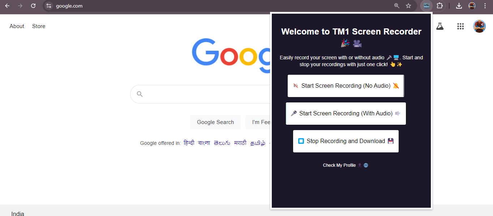
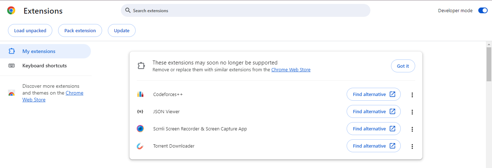
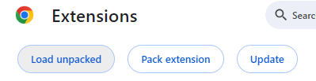
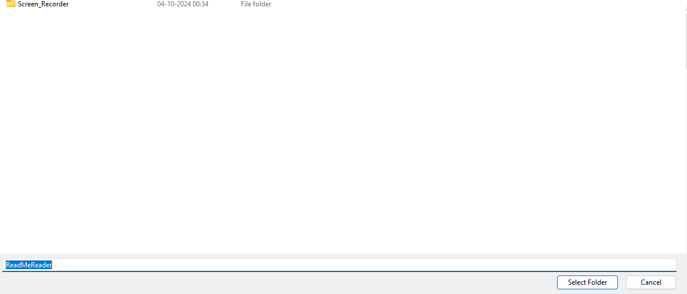
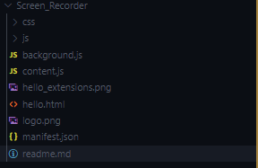

# TM1 Screen Recorder 🎥✨

## Overview (Only For Chrome in PC)



TM1 Screen Recorder is a simple and user-friendly Chrome extension that allows users to record their screen with or without audio. Easily start, stop, and download your recordings with a click of a button! No complicated setup—just a clean, intuitive interface.

## Features

- **Start Screen Recording (No Audio) 🔇🖥️**: Record your screen without capturing any audio.
- **Start Screen Recording (With Audio) 🎤🖥️**: Record your screen along with system and microphone audio.
- **Stop Recording and Download ⏹️💾**: End the recording and download the file with ease.
- Responsive, lightweight, and user-friendly design.
- Simple button animations and hover effects for an interactive experience.

## Demo

Try out the live demo or visit [my portfolio](https://tejas-mundhe-projects.netlify.app/) to see more projects! 🌐

## How to Use

1. **Clone the repository**:
   ```bash
   git clone https://github.com/yourusername/tm1-screen-recorder.git
   ```
2. **Navigate to the directory**:
   ```bash
   cd tm1-screen-recorder
   ```
3. **Open `index.html` in your browser** to test the UI locally.
4. For full functionality:

   - Package the extension for use in your Chrome browser.
   - Go to `chrome://extensions/` in Chrome.
   - Enable **Developer Mode**.
     

   - Click **Load Unpacked** and select the project folder.
     

   - Select Folder
     
   - Start recording your screen!

## Technology Stack

- **HTML5**
- **CSS3**
- **JavaScript**
- **Chrome API**

## Folder Structure



## Customization

Feel free to modify the colors, add animations, or tweak the styles by editing the `style.css` file. You can also add new features in `popup.js` to expand the screen recording functionality.

## License

This project is licensed under the MIT License. See the [LICENSE](LICENSE) file for more information.

## Contact

If you have any questions or suggestions, feel free to reach out:

- [LinkedIn](https://www.linkedin.com/in/tejas-mundhe) 👤
- [GitHub](https://github.com/tejasrockshere) 💻
- [Portfolio](https://tejas-mundhe-projects.netlify.app) 🌐

```

```
